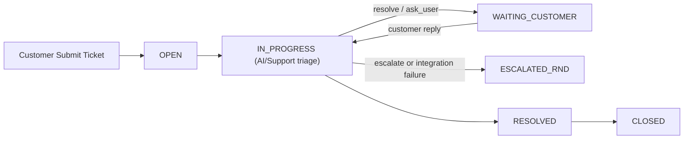

# ai-desk / NexusFlow (M1 + M2 Skeleton)

AI-first ticket management platform skeleton with:
- M1: Ticket core, state machine, portal/list/detail/agent queue APIs.
- M2: OpenClaw adapter interface and integration wiring.

## Stack
- `apps/web`: React 18 + TypeScript + Tailwind
- `apps/api`: Node.js + Express + TypeScript + PostgreSQL

## Quick Start
1. Copy env:
   - `cp .env.example .env`
2. Start Postgres:
   - `docker compose up -d`
3. Install dependencies:
   - `npm install`
4. Run migrations:
   - `npm run db:migrate`
5. Start dev servers:
   - `npm run dev`

Web: `http://localhost:5173`
API: `http://localhost:4000`

## Portal Access Map
- Customer Ticket Portal: `http://localhost:5173/`
- Customer Requests: `http://localhost:5173/requests`
- Customer Ticket Detail: `http://localhost:5173/tickets/:id`
- Internal Agent Portal: `http://localhost:5173/agent`

If `VITE_AGENT_ACCESS_CODE` is set in `.env`, `/agent` requires the temporary passcode.
Customer shell contains no link or hint to `/agent`.

## Submit Lifecycle

Internal-only APIs require header `x-portal-surface: internal`:
- `GET /api/v1/agent/tickets`
- `POST /api/v1/tickets/:id/transition`
- `POST /api/v1/tickets/:id/assign`

## API Contract
- OpenAPI: `apps/api/openapi.yaml`
- OpenClaw health check: `GET /api/v1/integrations/openclaw/health`
- Grounded search: `POST /api/v1/ai/search`
- Quick escalation: `POST /api/v1/ai/escalations`
- Escalation status: `GET /api/v1/ai/escalations/:id`
- Internal AI metrics summary: `GET /api/v1/ai/metrics/summary` (`x-portal-surface: internal`)

## Vercel Integrated Deployment (Web + API)
- This repo is configured to deploy:
  - Frontend static site from `apps/web/dist`
  - Backend API as serverless function at `api/index.ts`
- API is served on same domain under `/api/*`.
- Keep `VITE_API_BASE_URL` empty in Vercel to use same-origin routing.

Required Vercel Environment Variables:
- `DATABASE_URL`
- `OPENCLAW_WS_URL`
- `OPENCLAW_BASIC_USER`
- `OPENCLAW_BASIC_PASS`
- `OPENCLAW_GATEWAY_TOKEN`
- `OPENCLAW_REQUEST_SCOPES` (comma-separated, default includes `operator.admin`)
- `OPENCLAW_ALLOW_SELF_SIGNED` (set `true` only when OpenClaw uses self-signed cert)
- `OPENCLAW_CONNECT_TIMEOUT_MS`
- `OPENCLAW_METHOD_TIMEOUT_MS`
- `OPENCLAW_MAX_RETRIES`
- `OPENCLAW_CIRCUIT_BREAKER_THRESHOLD`
- `VITE_AGENT_ACCESS_CODE` (optional, for `/agent` gate)

## Notes
- Secrets are loaded from environment only.
- OpenClaw integration is behind `OPENCLAW_*` env values with safe fallback behavior.
- Release checklist: `docs/04_Release_Checklist.md`
- Rollout plan: `docs/05_AI_Search_Escalation_Rollout.md`
- Rollback runbook: `docs/06_AI_Search_Rollback_Runbook.md`
