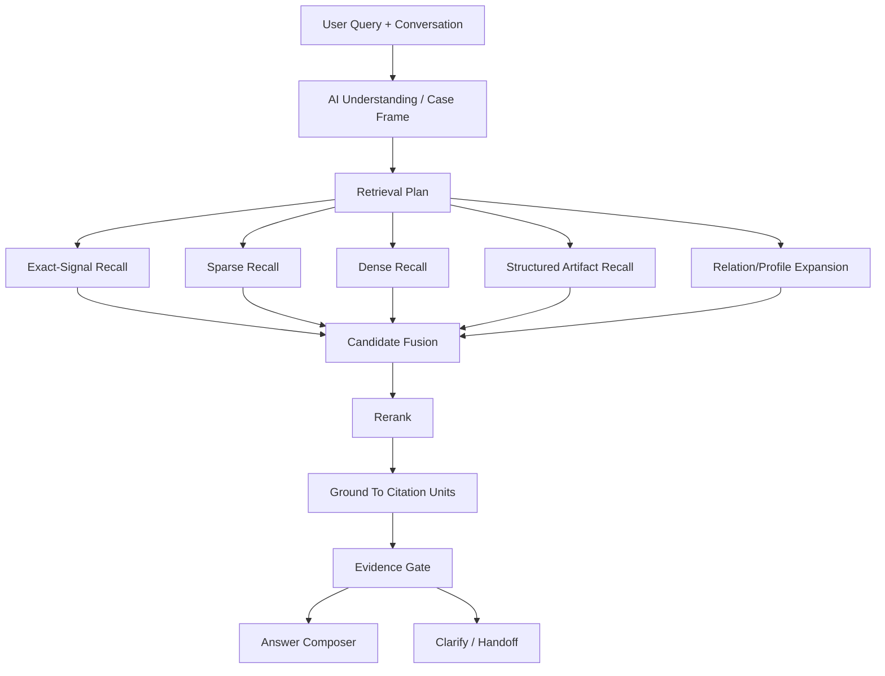

# AI Support Agent Rebuild Plan Part 04

Date: 2026-04-01

Status: implementation-ready design

Required pre-read:

1. `/Users/jeremypeng/Downloads/Workspace/TicketManagement/AGENTS.md`
2. `/Users/jeremypeng/Downloads/Workspace/TicketManagement/docs/20_AI_Support_Agent_Rebuild_Part_01_System_Model_And_Single_DB_Publishing.md`
3. `/Users/jeremypeng/Downloads/Workspace/TicketManagement/docs/21_AI_Support_Agent_Rebuild_Part_02_Single_DB_Build_Sync_Publish_And_Repair.md`
4. `/Users/jeremypeng/Downloads/Workspace/TicketManagement/docs/22_AI_Support_Agent_Rebuild_Part_03_Repository_Knowledge_Model_And_Retrieval_Units.md`

This part must be implemented together with the constraints defined in `AGENTS.md`, Part 01, Part 02, and Part 03.

If this document appears to conflict with an earlier part, the earlier part wins unless explicitly revised first.

Scope:

- define the runtime retrieval architecture for the AI support engineer agent
- define the roles of sparse retrieval, dense retrieval, exact-signal retrieval, metadata filtering, rerank, and grounding
- define how `kb_memory_entries`, canonical repository artifacts, `kb_chunks`, and `kb_citation_units` cooperate
- define query understanding and retrieval orchestration stage contracts
- define embedding placement in the retrieval runtime
- define acceptance gates for grounded evidence before answer composition

---

## 1. Pre-Implementation Confirmation

Before implementing anything in this part, the developer must confirm all of the following.

### 1.1 Hard prerequisites

Confirm:

- Part 02 publication-based serving remains the runtime source of truth
- Part 03 repository knowledge artifacts and citation units are defined
- the project still uses one shared DB
- new retrieval code will read only published snapshot data

If any of the above is false or unknown, stop and re-check Part 02 and Part 03 status before writing code.

### 1.2 This part defines retrieval runtime, not build publication

This part defines:

- how user queries become retrieval plans
- how recall channels are combined
- how rerank works
- how retrieval units are grounded to citation units
- what minimum evidence policy is required before answer generation

This part does **not** define:

- build/publication state machine
- environment promotion policy
- historical data cleanup

Those belong to Part 02 or later cleanup work.

### 1.3 Current runtime integration gate

As of this document:

- Part 03 DB substrate may exist
- isolated DB-backed verification may still be pending

Therefore:

- retrieval pipeline modules may be implemented now
- runtime integration must not replace the production path until isolated DB verification is complete

---

## 2. What This Part Delivers

This part answers one question:

> How should the AI support engineer agent retrieve the right knowledge, quickly and accurately, from repository-derived knowledge?

The answer is:

- not by vector-only search
- not by keyword-only search
- not by regex patches
- not by directly answering from memory abstractions

The runtime must use a staged hybrid pipeline:

1. AI question understanding
2. retrieval plan generation
3. multi-channel recall
4. fusion
5. rerank
6. grounding
7. evidence sufficiency check
8. answer composition or clarification

---

## 3. Frozen Runtime Principle

The support agent remains AI-driven.

Retrieval is a subsystem of the support agent.

Therefore:

- the retrieval stack must expose evidence, not final answers
- the support agent may reason over retrieved evidence, but may not invent unsupported claims
- no customer-facing answer may be composed from retrieval units alone

The fixed runtime order is:

1. conversation-aware understanding
2. case-frame extraction
3. retrieval-plan generation
4. recall channels
5. candidate fusion
6. rerank
7. citation grounding
8. evidence gate
9. answer composition

---

## 4. Retrieval Runtime Objects

The runtime retrieval layer operates over four object classes.

### 4.1 Retrieval abstractions

Primary object:

- `kb_memory_entries`

This remains the first-class retrieval abstraction layer.

It is used for:

- support-intent matching
- alias bridging
- signal matching
- relation expansion
- support-oriented semantic recall

It is not the final evidence layer.

### 4.2 Canonical repository artifacts

These are structured objects created in Part 03.

Examples:

- `kb_openapi_operations`
- `kb_code_symbols`
- `kb_config_surfaces`
- `kb_schema_objects`
- `kb_test_behaviors`

These are used for:

- structured recall
- metadata-aware rerank
- precise support reasoning

### 4.3 Citation units

Primary objects:

- `kb_citation_units`
- `kb_chunks`

These are used for:

- grounded evidence
- snippet extraction
- final answer citation

### 4.4 Publication boundary

All of the above must be filtered by:

- `knowledge_space`
- `repo_id`
- `branch`
- `published_build_version`

No retrieval stage may mix data from different published builds.

---

## 5. Retrieval Channels

The runtime must use multiple recall channels in parallel.

No single channel is allowed to decide final retrieval quality.

### 5.1 Channel A: exact-signal recall

Target:

- API path
- HTTP method
- scope
- error code
- env var
- config key
- symbol name
- table name
- callback URL / redirect URI / webhook route

Source objects:

- `kb_memory_signals`
- canonical artifact metadata
- exact fields on citation units

Use when:

- the user asks about a precise technical object
- the problem statement contains structured identifiers

Why it matters:

- support and troubleshooting questions often hinge on exact identifiers
- dense retrieval alone is weak on high-precision technical tokens

### 5.2 Channel B: sparse lexical recall

Target:

- rare phrases
- log fragments
- code identifiers
- Chinese/English mixed symptom phrasing
- issue titles
- doc wording overlap

Source objects:

- `kb_memory_entries.search_text`
- `kb_chunks.lexical_content`
- `kb_citation_units.snippet_text`

Recommended implementation:

- Postgres FTS and trigram where already available
- optional BM25-equivalent layer later if needed

Why it matters:

- troubleshooting often starts from symptom phrases, not semantic paraphrases

### 5.3 Channel C: dense semantic recall

Target:

- phrasing mismatch
- synonym mismatch
- support intent similarity
- multilingual paraphrase
- user language vs repository wording mismatch

Primary embedding targets:

1. `kb_memory_entries.search_text`
2. `kb_citation_units.embedding_text` or snippet text
3. `kb_chunks.content`

Dense retrieval is strongly recommended in this project.

This repository is too semantically varied for a no-embedding design to remain optimal.

### 5.4 Channel D: structured artifact recall

Target:

- OpenAPI operations
- code symbols
- config surfaces
- schema constraints
- test behaviors

This channel is not a free-text search clone.

It must use family-aware fields such as:

- route path
- method
- operation id
- symbol name
- normalized config key
- schema object name
- behavior key

This channel improves both precision and explainability.

### 5.5 Channel E: relation/profile expansion

Target:

- adjacent concepts
- derived troubleshooting patterns
- procedure follow-ups
- related config or API dependencies

Source objects:

- memory relations
- memory profiles

This channel is secondary.

It must not overrule stronger direct evidence.

---

## 6. Query Understanding Contract

Retrieval must start from AI understanding, not raw query strings.

The upstream agent stage must produce a retrieval input contract with at least:

- `query`
- `rewrites`
- `case_frame`
- `required_doc_kinds`
- `required_object_types`
- `support_signals`
- `answer_language`
- `conversation_context_summary`

### 6.1 Case frame

The case frame should capture:

- user intent
- object of concern
- symptom
- requested action
- deployment context
- product area hints
- required evidence kinds

### 6.2 Query rewrites

Rewrites are allowed only as semantic retrieval assistance.

They must not become customer-answer hacks.

Allowed rewrite classes:

- canonical terminology normalization
- Chinese/English phrase bridging
- symptom-to-technical-phrase bridging
- abbreviation expansion
- likely object name normalization

Forbidden rewrite classes:

- hardcoded special-case answers
- string replacement that makes one narrow query pass
- answer-text steering

---

## 7. Canonical Retrieval Pipeline

This is the frozen retrieval pipeline to implement.

### Stage 1. Query intake

Inputs:

- current user message
- multi-turn conversation state
- ticket context if present
- role/context metadata

Outputs:

- normalized retrieval request

### Stage 2. AI understanding

The support planner or evidence planner produces:

- case frame
- rewrites
- required evidence types
- required doc kinds

### Stage 3. Parallel recall

Run these channels concurrently:

- exact-signal recall
- sparse lexical recall on memory entries
- sparse lexical recall on citation units/chunks
- dense recall on memory entries
- dense recall on citation units
- structured artifact recall
- optional relation/profile expansion

Each channel returns:

- candidate id
- candidate family
- raw score
- matched fields
- build version
- metadata needed for rerank

### Stage 4. Candidate normalization

Normalize all channel outputs onto a common candidate form:

- `candidate_type`
- `candidate_id`
- `retrieval_abstraction_id`
- `citation_candidate_ids`
- `raw_channel_scores`
- `match_metadata`

### Stage 5. Fusion

Fusion combines channels without letting one noisy channel dominate.

Recommended baseline:

- weighted reciprocal rank fusion

Suggested starting weights:

- exact-signal: `1.00`
- structured artifact recall: `0.95`
- sparse memory recall: `0.85`
- dense memory recall: `0.80`
- sparse citation recall: `0.72`
- dense citation recall: `0.68`
- relation expansion: `0.40`

These are starting values, not fixed forever.

### Stage 6. Rerank

Rerank uses richer features unavailable to pure recall.

Required rerank features:

- channel agreement
- exact signal overlap
- case-frame fit
- required doc kind fit
- object type fit
- product area fit
- deployment model fit
- artifact family preference
- citation availability
- degraded parser penalty
- freshness/build consistency check

Preferred rerank strategy:

1. rule-light feature rerank first
2. optional embedding similarity tie-break
3. optional cross-encoder or LLM rerank later

Do not start with LLM rerank as the only quality mechanism.

### Stage 7. Grounding

Top reranked retrieval abstractions must be grounded to citation units.

Grounding order:

1. citation units linked from memory entries
2. citation units linked from structured artifacts
3. fallback chunks only when grounded citation units are absent

Grounding must preserve:

- path
- title
- heading path or source location
- snippet text
- source artifact family
- build version

### Stage 8. Evidence gate

Before answer composition, enforce:

- at least one grounded citation for every major claim
- no cross-build evidence
- no citation from unpublished data
- no evidence-only-on-memory-summary

If evidence is insufficient:

- ask a clarification question
- or return low-confidence support answer
- or hand off

### Stage 9. Answer composition

Only grounded evidence may feed the final customer answer.

---

## 8. Embedding Strategy

Embedding should be part of the official design.

This project benefits materially from embeddings.

### 8.1 Why embeddings are needed here

Repository knowledge has:

- multilingual phrasing mismatch
- code names vs user wording mismatch
- troubleshooting symptom mismatch
- doc wording vs support wording mismatch

Dense recall is needed to bridge these gaps.

### 8.2 Embedding targets

Priority order:

1. `kb_memory_entries.search_text`
2. `kb_citation_units.embedding_text` or `snippet_text`
3. `kb_chunks.content`

Secondary later targets:

- canonical artifact family summaries

### 8.3 Embedding usage rules

Dense retrieval may improve recall.

Dense retrieval must not:

- bypass publication filter
- bypass evidence gate
- answer directly

### 8.4 Embedding failure policy

If embeddings are partially missing:

- retrieval must degrade to sparse + exact-signal + structured artifact recall
- runtime must not fail closed unless all retrieval channels are unavailable

---

## 9. Family-Aware Retrieval Policy

Retrieval must not treat all evidence families equally.

### 9.1 API questions

Prefer:

- OpenAPI operations
- permission rules
- request/response constraints
- related config if auth or callback is involved

Penalty:

- generic docs without operation grounding

### 9.2 Configuration/setup questions

Prefer:

- config surfaces
- procedures
- runbook docs
- env var citations

### 9.3 Troubleshooting questions

Prefer:

- troubleshooting patterns
- runbooks
- test behaviors
- code symbol responsibilities
- schema constraints if error implies data constraint

### 9.4 Behavior questions

Prefer:

- behavior rules
- tests
- code symbols
- product docs

### 9.5 Infrastructure/deployment questions

Prefer:

- deploy docs
- runbooks
- config surfaces
- schema or migration artifacts if deployment affects data

---

## 10. Minimum Evidence Policy

The answer pipeline must enforce the following minimums.

### 10.1 Grounding minimum

A final answer should not be emitted when all of the following are true:

- top evidence comes only from memory abstraction
- no citation unit exists
- no chunk exists
- exact structured object is missing

### 10.2 Major-claim rule

Every major operational recommendation must have at least one grounded citation.

### 10.3 Troubleshooting rule

Troubleshooting answers should ideally include at least two evidence types:

- symptom/behavior evidence
- action/config/API/schema evidence

### 10.4 Clarification fallback

If the query is underspecified and evidence diverges:

- ask the smallest clarifying question needed to disambiguate

---

## 11. Runtime Data Flow

---

## 12. Required Modules

The implementation should be split into modules close to these boundaries.

### 12.1 Query understanding adapter

Responsibilities:

- convert planner output into retrieval request contract

### 12.2 Recall orchestrator

Responsibilities:

- run recall channels in parallel
- collect raw candidates

### 12.3 Fusion engine

Responsibilities:

- normalize candidates
- compute fused score

### 12.4 Rerank engine

Responsibilities:

- apply feature-based rerank
- produce top abstractions

### 12.5 Grounding resolver

Responsibilities:

- resolve memory entries to citation units
- fallback to chunks when allowed

### 12.6 Evidence gate

Responsibilities:

- reject ungrounded answer candidates

### 12.7 Retrieval diagnostics

Responsibilities:

- channel contribution visibility
- failure analysis
- eval feature logging

---

## 13. Observability And Eval

Every retrieval request should emit structured diagnostics.

Minimum diagnostic fields:

- query
- rewrites
- case-frame summary
- active knowledge space
- published build version
- per-channel candidate counts
- per-channel top ids
- rerank top ids
- grounding success rate
- evidence-family mix
- final confidence

### 13.1 Eval dimensions

The eval set should measure:

- retrieval recall at K
- citation grounding rate
- exact-identifier hit rate
- troubleshooting usefulness
- wrong-family retrieval rate
- hallucination-prevention rate

### 13.2 Failure buckets

Track failures as:

- no recall
- wrong family recall
- right family, wrong citation
- good recall, poor rerank
- good evidence, poor answer composition

---

## 14. Implementation Order

This is the required order for Part 04 implementation.

### Step 1

Implement retrieval request contract and diagnostics schema.

### Step 2

Implement recall orchestrator with no runtime cutover.

### Step 3

Implement fusion and feature-based rerank.

### Step 4

Implement grounding resolver and evidence gate.

### Step 5

Add embedding-backed recall into the orchestrator.

### Step 6

Run isolated DB-backed retrieval verification.

### Step 7

Only after verification, allow staged runtime integration behind a feature flag.

---

## 15. Parallelization And Dependency Summary

This section is mandatory for downstream AI developers.

### 15.1 Can start now in parallel

These can be implemented now:

- retrieval request contract
- recall orchestrator
- exact-signal recall channel
- sparse recall channel
- dense recall channel implementation
- structured artifact recall channel
- fusion engine
- rerank engine
- grounding resolver
- evidence gate
- retrieval diagnostics
- eval dataset and score scripts

### 15.2 Can be developed now but must not yet replace production runtime

These may be implemented and tested in isolation now:

- embedding-backed retrieval
- staged hybrid retrieval endpoint
- support-agent retrieval adapter
- feature-flagged alternative retrieval path

These must not yet replace the current production retrieval path until isolated DB-backed verification is complete.

### 15.3 Must wait before starting integration

These must wait for isolated DB-backed verification of Part 03 substrate:

- production cutover to Part 04 retrieval path
- making support-agent primary runtime depend on the new hybrid stack
- running destructive sync/reindex validation in shared DB
- declaring retrieval quality ready for production tuning

### 15.4 Pre-integration confirmation

Before any runtime integration starts, the developer must confirm:

- Part 02 publication substrate is active in the target DB
- Part 03 DB substrate exists in the target DB
- Part 03 DB-backed verification has run in an isolated environment
- no retrieval path still depends on unpublished data

If any of these are false or unknown, stop before integration.

---

## 16. Forbidden Shortcuts

The following are explicitly forbidden:

1. using only vector recall as the new retrieval system
2. using only keyword recall as the new retrieval system
3. answering directly from `kb_memory_entries` without grounded citation
4. bypassing publication filters for convenience
5. query-specific regex hacks to make narrow cases pass
6. hand-written answer patches over retrieved text
7. letting relation expansion dominate direct evidence
8. mixing evidence from multiple builds

---

## 17. Acceptance Criteria

Part 04 is only complete when all of the following are true:

1. retrieval pipeline stages are explicitly separated in code
2. at least four recall channels exist:
   - exact-signal
   - sparse
   - dense
   - structured artifact
3. fusion and rerank exist and are observable
4. grounding to citation units is enforced
5. evidence gate blocks unsupported answers
6. runtime reads only published snapshot data
7. isolated DB-backed verification has completed
8. production cutover is still gated behind explicit approval

