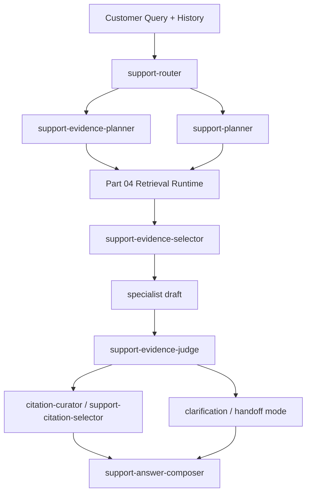

# AI Support Agent Rebuild Plan Part 05

Date: 2026-04-01

Status: implementation-ready design

Required pre-read:

1. `/Users/jeremypeng/Downloads/Workspace/TicketManagement/AGENTS.md`
2. `/Users/jeremypeng/Downloads/Workspace/TicketManagement/docs/20_AI_Support_Agent_Rebuild_Part_01_System_Model_And_Single_DB_Publishing.md`
3. `/Users/jeremypeng/Downloads/Workspace/TicketManagement/docs/21_AI_Support_Agent_Rebuild_Part_02_Single_DB_Build_Sync_Publish_And_Repair.md`
4. `/Users/jeremypeng/Downloads/Workspace/TicketManagement/docs/22_AI_Support_Agent_Rebuild_Part_03_Repository_Knowledge_Model_And_Retrieval_Units.md`
5. `/Users/jeremypeng/Downloads/Workspace/TicketManagement/docs/24_AI_Support_Agent_Rebuild_Part_04_Hybrid_Retrieval_And_Orchestration.md`
6. `/Users/jeremypeng/Downloads/Workspace/TicketManagement/docs/01_OpenClaw_Integration_Spec.md`
7. `/Users/jeremypeng/Downloads/Workspace/TicketManagement/docs/agents/support-answer-composer.md`

This part must be implemented together with the constraints defined in `AGENTS.md`, Part 01, Part 02, Part 03, and Part 04.

If this document appears to conflict with an earlier part, the earlier part wins unless explicitly revised first.

Scope:

- define the AI-native support runtime around OpenClaw multi-agent orchestration
- define stage contracts between router, planner, retrieval, evidence selection, specialists, verification, citation selection, and answer composition
- define failure boundaries, downgrade rules, and no-cross-stage responsibilities
- define runtime traces, diagnostics, and idempotency expectations
- define which stages may be skipped, retried, or replaced by local fallbacks

---

## 1. Pre-Implementation Confirmation

Before implementing anything in this part, the developer must confirm all of the following.

### 1.1 Runtime source-of-truth confirmation

Confirm:

- the support pipeline remains OpenClaw-driven
- live OpenClaw topology is still the repository source of truth for stage roles
- Part 04 retrieval remains a subsystem, not a separate answer path
- customer-facing answers still flow through the shared support-agent runtime

If any of the above is false or unknown, stop and re-check the live runtime assumptions before writing code.

### 1.2 This part defines stage contracts, not retrieval internals

This part defines:

- stage ownership
- stage input/output payloads
- orchestration order
- retries, skips, and fallback rules
- trace and diagnostics requirements

This part does **not** redefine:

- publication visibility
- repository knowledge schema
- hybrid retrieval algorithm details

Those belong to Part 02, Part 03, and Part 04.

### 1.3 Current integration gate

At the time of this document:

- Part 04 focused tests pass
- top-level scope contracts are still incomplete for some entry paths
- production cutover is still not approved

Therefore:

- stage contracts may be implemented now
- trace/adapter cleanup may be implemented now
- production behavior changes must remain behind explicit control

---

## 2. What This Part Delivers

This part answers one question:

> How should the AI support engineer agent be decomposed into cooperating stages without collapsing back into hidden rule logic or tangled prompts?

The answer is:

- each stage must have one narrow responsibility
- each stage must receive structured input and emit structured output
- no stage should silently redo another stage's job
- no stage should act on unpublished or ungrounded knowledge

This part turns the current support runtime from "working code with implicit coupling" into an explicit staged system.

---

## 3. Frozen Runtime Principle

The support flow remains one AI-driven pipeline.

That means:

- no parallel legacy answer path beside the shared support-agent pipeline
- no stage-specific hardcoded answer builders for narrow cases
- no query regex patches used as orchestration substitutes

The fixed runtime order is:

1. route
2. evidence plan
3. case planning
4. retrieval
5. evidence selection
6. specialist drafting
7. verification
8. citation selection
9. answer composition

Some stages may be skipped under controlled rules, but the order may not be arbitrarily rearranged.

---

## 4. Stage Map

The support runtime should be modeled as nine stage families.

### 4.1 Router

OpenClaw role:

- `support-router`

Responsibility:

- classify support question type
- define answer contract
- choose specialist family

Must not:

- retrieve evidence
- answer the question
- decide citations

### 4.2 Evidence Planner

OpenClaw role:

- `support-evidence-planner`

Responsibility:

- decide retrieval rounds
- define required doc kinds
- define evidence priority
- define retrieval emphasis

Must not:

- finalize case semantics
- answer the question

### 4.3 Case Planner

OpenClaw role:

- `support-planner`

Responsibility:

- produce case frame
- normalize goal, symptom, object, action, product area, deployment model
- expose missing critical info

Must not:

- perform retrieval
- invent citations

### 4.4 Retrieval Runtime

Runtime subsystem:

- local orchestrator + Part 04 hybrid retrieval stack

Responsibility:

- convert route + plan + case frame into grounded evidence candidates

Must not:

- produce customer-facing answer text
- replace verification

### 4.5 Evidence Selector

OpenClaw role:

- `support-evidence-selector`

Responsibility:

- choose primary and supplemental references from retrieved candidates

Must not:

- invent missing evidence
- answer the question

### 4.6 Specialist Drafting

OpenClaw roles:

- `support-api-specialist`
- `support-howto-specialist`
- `support-behavior-specialist`
- `support-troubleshooting-specialist`

Responsibility:

- produce scenario-appropriate draft answer structure
- convert evidence bundle into support-engineer phrasing

Must not:

- re-route the case
- ignore unsupported evidence
- invent claims without evidence ids

### 4.7 Verification

OpenClaw roles:

- `support-evidence-judge`
- `support-citation-binder`

Responsibility:

- determine which claims are supported
- reject unsupported claims
- map claims to evidence ids

Must not:

- write the final customer answer

### 4.8 Citation Selection

OpenClaw roles:

- `citation-curator`
- `support-citation-selector`

Responsibility:

- pick the minimum high-value display citations

Must not:

- change verdict semantics
- widen unsupported evidence

### 4.9 Answer Composer

OpenClaw role:

- `support-answer-composer`

Responsibility:

- produce final customer-facing answer shape following repository answer contract

Must not:

- change retrieval verdict
- invent new evidence
- re-route the question

---

## 5. Canonical Stage Inputs And Outputs

Every stage must consume and emit structured objects.

No stage may depend on hidden prompt-only state.

### 5.1 Router output

Required fields:

- `question_type`
- `user_goal`
- `answer_contract`
- `specialist_agent`
- `routing_confidence`

### 5.2 Evidence plan output

Required fields:

- `query_plan`
- `evidence_priority`
- `required_doc_kinds`
- `retrieval_rounds`
- `allow_refinement`
- `stop_after_grounded_evidence`

### 5.3 Case frame output

Required fields:

- `goal`
- `symptom`
- `object`
- `action_type`
- `deployment_model`
- `product_area`
- `constraints`
- `missing_critical_info`
- `retrieval_queries`

Preferred future field:

- `required_object_types`

### 5.4 Retrieval output

Required fields:

- `references`
- `retrieval_status`
- `confidence`
- `resolved_queries`
- `unresolved_reason_code`

Optional diagnostics:

- retrieval traces
- fusion ids
- grounding success rate

### 5.5 Evidence selection output

Required fields:

- `primary_ids`
- `supplemental_ids`
- `rejected_ids`

### 5.6 Specialist draft output

Required fields:

- `question_type`
- `render_variant`
- `direct_answer`
- `claims`
- `next_actions`
- `unknowns`
- `escalation_needed`

Each claim must have:

- `text`
- `kind`
- `evidence_ids`
- `authority`

### 5.7 Verification output

Required fields:

- `verdict`
- `unsupported_claims`
- `missing_info`
- `verified_citation_ids`
- `display_citation_ids`
- `claim_to_citation_map`

### 5.8 Final answer output

Must conform to:

- `/Users/jeremypeng/Downloads/Workspace/TicketManagement/docs/agents/support-answer-composer.md`

---

## 6. Stage Ownership Rules

This section is mandatory and frozen.

### 6.1 Router ownership

Owned by router:

- question type
- high-level answer contract
- specialist family

Not owned by router:

- retrieval query details
- evidence verdict

### 6.2 Planner ownership

Owned by evidence planner and case planner together:

- retrieval focus
- missing info classification
- case semantics

Not owned by planners:

- final customer wording

### 6.3 Retrieval ownership

Owned by local retrieval subsystem:

- recall
- fusion
- rerank
- grounding

Not owned by retrieval:

- customer answer mode
- claim verification

### 6.4 Specialist ownership

Owned by specialist:

- scenario-specific answer draft structure

Not owned by specialist:

- whether unsupported claims may be shown

### 6.5 Verification ownership

Owned by verification:

- supported vs unsupported claims
- which evidence ids are safe to show

Not owned by verification:

- final prose style

### 6.6 Answer composer ownership

Owned by answer composer:

- final customer-facing answer shape
- section ordering
- concise, support-style wording

Not owned by answer composer:

- evidence verdict
- route changes
- retrieval changes

---

## 7. Runtime Control Flow

---

## 8. Retrieval Cooperation Contract

This part depends on Part 04.

The retrieval stage must receive:

- route output
- evidence plan
- case frame
- conversation-aware user query

The retrieval stage should return:

- grounded references
- retrieval status
- diagnostics

The support runtime must not:

- re-run retrieval inside specialists
- let specialists ask for arbitrary ad hoc search

If later tool-based specialist retrieval is added, it must still go through the shared retrieval contract.

---

## 9. Clarification And Handoff Policy

Clarification and handoff are runtime modes, not ad hoc exceptions.

### 9.1 Clarification mode

Use only when:

- one or two missing facts block reliable answer generation
- evidence indicates a likely path but cannot safely conclude

Do not use when:

- evidence is simply absent
- the answer should already be handoff

### 9.2 Handoff mode

Use when:

- evidence is insufficient for safe self-serve answer
- missing information is too broad
- evidence conflicts materially

### 9.3 Grounded mode

Use when:

- supported claims exist
- answer can directly address the question

### 9.4 Partial mode

Use when:

- core answer is supported
- some side claims remain unsupported

Partial mode must not expose unsupported claims in final customer prose.

---

## 10. Retry, Skip, And Fallback Rules

Not every stage must run every time.

But skip/fallback rules must be explicit.

### 10.1 Router fallback

Allowed when:

- router call times out or fails

Fallback behavior:

- local route heuristic may be used

### 10.2 Planner fallback

Allowed when:

- evidence planner or case planner fails

Fallback behavior:

- local fallback case frame / evidence plan may be used

### 10.3 Retrieval fallback

Allowed when:

- hybrid retrieval is unavailable
- KB unavailable

Fallback behavior:

- local docs fallback only if explicitly allowed by runtime path

Do not silently turn KB unavailable into fake grounded evidence.

### 10.4 Specialist skip

Allowed when:

- stage budget says stop after grounded evidence
- evidence bundle is already strong and answer shape can be safely composed

### 10.5 Verification fallback

Allowed when:

- verifier fails

Fallback behavior:

- writer-bound evidence-limited verification may be used

But unsupported claims must still be filtered conservatively.

### 10.6 Citation selector skip

Allowed when:

- no supported claims exist
- no display citations are needed

### 10.7 Answer composer skip

Allowed when:

- fast path already produced a safe final answer structure

---

## 11. Stage Budgets And Time Limits

Each stage should have a declared budget.

The exact numbers may evolve, but the concept is mandatory.

Minimum budgeting model:

- route budget
- planner budget
- retrieval base budget
- retrieval extra budget
- specialist budget
- verifier budget
- citation budget
- composer budget

The runtime must be able to:

- skip later expensive stages when confidence is already sufficient
- stop extra retrieval rounds when budget is too low
- return handoff instead of over-running

---

## 12. Idempotency And Traceability

The runtime must be replayable and diagnosable.

### 12.1 Idempotency keys

All stage calls must derive from a root idempotency key.

Pattern:

- `root:route`
- `root:evidence-plan`
- `root:plan`
- `root:evidence`
- `root:evidence:extra`
- `root:specialist`
- `root:judge`
- `root:citation-curator`
- `root:answer-composer`

### 12.2 Stage trace

Every support run should emit:

- stage name
- agent id
- duration
- completed / fallback / skipped
- reference count
- query count when relevant

### 12.3 Internal diagnostics

The final runtime object should preserve:

- route
- evidence plan
- retrieval queries used
- retrieval queries refined
- claim graph
- stage timings

These remain internal only.

---

## 13. Failure Boundaries

The support runtime must distinguish:

- `kb_unavailable`
- `no_results`
- `low_confidence`
- `unsupported`
- `handoff_required`

### 13.1 `kb_unavailable`

Means:

- published snapshot unavailable
- retrieval infrastructure unavailable
- hybrid runtime unavailable

### 13.2 `no_results`

Means:

- retrieval ran
- no grounded evidence was found

### 13.3 `low_confidence`

Means:

- some evidence exists
- not enough for a strong answer

### 13.4 `unsupported`

Means:

- draft claims are not evidence-supported

These states must not be merged casually.

---

## 14. Claim Contract

Claims are the bridge between evidence and answer.

### 14.1 Required claim shape

Every claim must have:

- text
- kind
- evidence ids
- authority

### 14.2 Claim kinds

Allowed:

- `verified_fact`
- `grounded_inference`
- `operational_advice`
- `unknown`

### 14.3 Claim filtering

Final answer may only expose:

- verified facts
- supported inferences
- operational advice grounded by supported evidence

Unsupported claims must be removed before final answer composition.

---

## 15. Citation Contract

Customer-facing citations must be selected from verified evidence only.

### 15.1 Citation source

Display citations must come from:

- verified claim-linked evidence ids

### 15.2 Citation limit

Show the minimum useful number.

Prefer:

- 1 to 3 high-value citations

### 15.3 Citation family preference

Prefer:

- direct API evidence for API questions
- direct runbook/config evidence for troubleshooting and how-to

---

## 16. OpenClaw Adapter Contract

The adapter boundary must be explicit.

### 16.1 Adapter responsibilities

The adapter should:

- call the right remote agent
- normalize the JSON payloads
- enforce stage-specific schemas
- attach stage runtime metadata

### 16.2 Adapter must not

- invent business logic hidden from local runtime
- silently reinterpret fields across stages
- turn invalid stage output into success without marking fallback

### 16.3 Normalization requirement

If a remote agent omits optional fields:

- normalize safely

If a remote agent violates required shape:

- reject or fallback explicitly

---

## 17. Live Runtime Alignment

This repository must stay aligned with the live OpenClaw gateway topology.

At minimum, implementation must assume the following live roles may exist:

- `search-retrieval`
- `search-clarify`
- `support-router`
- `support-evidence-planner`
- `support-planner`
- `support-evidence-selector`
- `support-api-specialist`
- `support-howto-specialist`
- `support-behavior-specialist`
- `support-troubleshooting-specialist`
- `support-evidence-judge`
- `support-citation-curator`
- `support-citation-selector`
- `support-answer-composer`

Do not derive runtime mappings from stale local OpenClaw files.

---

## 18. Implementation Order

This is the required order for Part 05 implementation.

### Step 1

Freeze stage payload schemas and TypeScript contracts.

### Step 2

Refactor adapter normalization so each stage has explicit input/output handling.

### Step 3

Refactor support-agent orchestration to align exactly with stage ownership rules.

### Step 4

Standardize stage traces, timings, and fallback markers.

### Step 5

Refine skip/retry/fallback logic without changing customer-facing answer path.

### Step 6

Only after verification, allow controlled runtime tightening of stage budgets and contracts.

---

## 19. Parallelization And Dependency Summary

This section is mandatory for downstream AI developers.

### 19.1 Can start now in parallel

These can be implemented now:

- stage schema definitions
- adapter normalization cleanup
- stage trace normalization
- stage timing model cleanup
- explicit specialist draft contract cleanup
- verification output contract cleanup
- citation selector contract cleanup
- internal diagnostics cleanup

### 19.2 Can be developed now but must not yet alter production behavior materially

These may be implemented behind feature guards or with compatibility layers:

- stricter stage input validation
- stricter fallback markers
- more explicit claim contract enforcement
- more explicit stage-specific adapter routing

### 19.3 Must wait before integration tightening

These must wait for stronger Part 04 runtime validation and approval:

- production-only behavior tightening that changes answer mode decisions
- aggressive budget cuts that skip currently used stages
- making new stage contracts mandatory for all existing entry paths

### 19.4 Pre-integration confirmation

Before tightening live runtime behavior, the developer must confirm:

- Part 04 retrieval path is stable in focused validation
- top-level scope contracts are understood
- no hidden legacy answer path will be broken by stricter stage contracts

If any of these are false or unknown, stop before integration.

---

## 20. Forbidden Shortcuts

The following are explicitly forbidden:

1. letting specialists redo retrieval freely
2. letting answer composer change verdict semantics
3. using fallback outputs without marking fallback
4. hiding missing fields with silent data invention
5. adding stage-specific regex answer patches
6. skipping verification while still presenting claims as supported
7. showing citations not linked to verified claims
8. flattening the entire runtime into one giant prompt again

---

## 21. Acceptance Criteria

Part 05 is only complete when all of the following are true:

1. each runtime stage has an explicit typed contract
2. stage ownership is clear in code and adapter boundaries
3. fallback and skip behavior is explicit and traceable
4. verification remains distinct from answer composition
5. citation selection remains distinct from verification
6. customer-facing answers still follow the repository answer-composer contract
7. stage timings and diagnostics are available for runtime inspection
8. no new parallel legacy answer path is introduced

